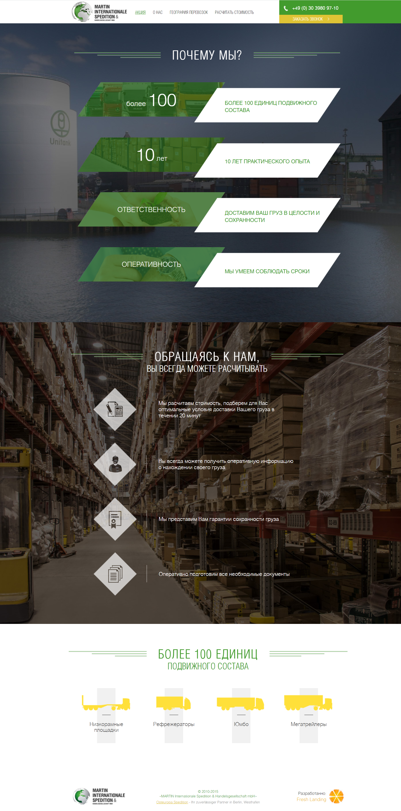

# BeeInterns-10 
## hw - day10 

<i>Styling of landing_page</i> for <b>Martin Internationale Spedition</b> provided by academic course:

Условие ДЗ:

-  задание заверстать лендинг

-  дан макет в jpeg и набор картинок

- [x] на выходе должна быть папка html, внутри нее index.html, в папке images - картинки, в папке styles - подключенные стили

  
